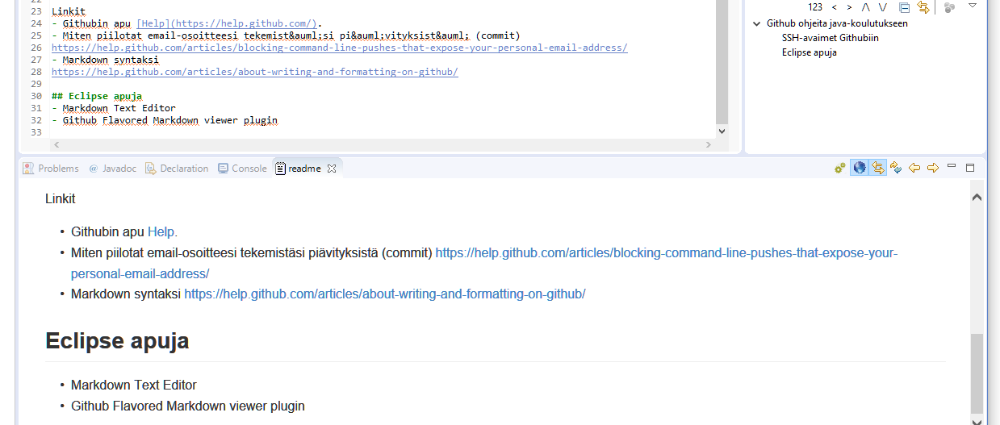

# Github ohjeita java-koulutukseen

Tiedostosta `readme.md`. P&auml;&auml;te voi olla my&ouml;s `markdown`.
Skandit tarttee kirjoittaa `&auml;` on &auml; ja `&ouml;` on &ouml; 

## Git asetukset
[Ensmm&auml;iset asetukset](https://git-scm.com/book/en/v2/Getting-Started-First-Time-Git-Setup)

## SSH-avaimet Githubiin

[Oman koneen avainten tarkistus](https://help.github.com/articles/checking-for-existing-ssh-keys/)

Git Bash

```
userid@systemname MINGW64 /drive/path_where_gitbash_was_opened
$ ls -al ~/.ssh
total 22
drwxr-xr-x 1 userid 197609    0 Jan  3 15:47 ./
drwxr-xr-x 1 userid 197609    0 Apr  2 22:17 ../
-rw-r--r-- 1 userid 197609 1766 Jan  6  2017 id_rsa
-rw-r--r-- 1 userid 197609  400 Jan  6  2017 id_rsa.pub
-rw-r--r-- 1 userid 197609  222 Jan  3 15:47 known_hosts
```

[Avaimen lis&auml;ys Githubiin](https://help.github.com/articles/adding-a-new-ssh-key-to-your-github-account/)

Linkit
- Githubin apu [Help](https://help.github.com/).
- Miten piilotat email-osoitteesi tekemist&auml;si pi&auml;vityksist&auml; (commit)
https://help.github.com/articles/blocking-command-line-pushes-that-expose-your-personal-email-address/
- Markdown syntaksi
https://help.github.com/articles/about-writing-and-formatting-on-github/

## Eclipse apuja
- Markdown Text Editor
- Github Flavored Markdown viewer plugin

N&auml;kyv&auml;t Eclipsess&auml; seuraavasti


Format: 